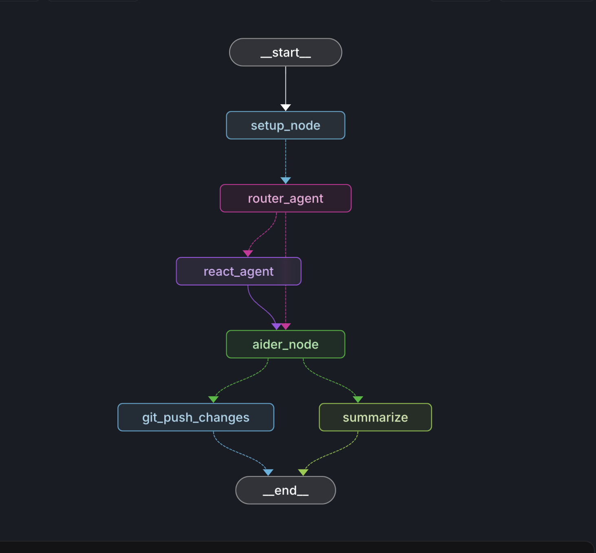

# Github Langgraph App




The main Langgraph app code is in the `src` folder.

Read the Issues.md file for important issues with the current graph.

## Setup Guide

This guide will help you deploy the LangGraph app locally using Docker Compose.

### Prerequisites

1. Get required API keys:
   - LangSmith API Key
   - Anthropic API Key
   - OpenAI API Key (optional)


## Quick Start (Langgraph Studio)

Rename the `.env.example` file to `.env` and add your API keys.

```bash
export LANGSMITH_API_KEY=your_langsmith_key
```

```bash
langgraph up
```

the required inputs for the graph are:
 - Repo Url (https://github.com/username/repo-name)
 - Repo Path (/user/123456)
 - Github Token (Github Access token from your [account](https://github.com/settings/tokens))
 - Message (the task or question you're asking)


------------------------------------------------------------------------------------------------


### Quick Start (Local Deployment)

For Local deployment:
- Install [Docker](https://docs.docker.com/engine/install/)
- Install [Docker Compose](https://docs.docker.com/compose/install/)

Make sure Docker is running.

1. Clone this repository:

```
git clone https://github.com/RVCA212/LM-Systems
cd LM-Systems
```

2. Configure environment variables:
- Edit `.env` and add your API keys:
```
LANGSMITH_API_KEY=your_langsmith_key
OPENAI_API_KEY=your_openai_key
ANTHROPIC_API_KEY=your_anthropic_key
```

3. Build and start the services:
```bash
langgraph build -t my-image
```

```bash
docker compose up --build
```

The app will be available at:
- API: http://localhost:8123
- API Documentation: http://localhost:8123/docs
- LangGraph Studio: https://smith.langchain.com/studio/?baseUrl=http://127.0.0.1:8123

You can test the sdk in the `connecting.ipynb` file or by following the Langgraph Studio Link.


### Local Deployment Architecture

The deployment consists of three containers:

1. **langgraph-redis** (Redis 6):
   - Handles real-time message queuing and streaming
   - Runs on default Redis port internally

2. **langgraph-postgres** (PostgreSQL 16):
   - Stores persistent data and thread history
   - Exposed on port 5433 locally

3. **langgraph-api** (LangGraph Server):
   - Runs the main application logic
   - Exposed on port 8123 locally

### Using the API

You can interact with the deployed app using:

1. **Direct API calls:**
```python
from langgraph_sdk import get_client

client = get_client(url="http://localhost:8123")
```

2. **Remote Graph:**
```python
from langgraph.pregel.remote import RemoteGraph

graph_name = "your_graph_name"
remote_graph = RemoteGraph(graph_name, url="http://localhost:8123")
```

### Key Features

1. **Thread Management:**
   - Create new threads
   - Access thread history
   - Copy/fork existing threads

2. **Run Execution:**
   - Execute synchronous runs
   - Stream responses in real-time
   - Background processing support

3. **State Management:**
   - Access and modify thread states
   - Checkpoint system for state recovery
   - Cross-thread memory persistence

### Troubleshooting

1. **Service Health Checks:**
   - Redis: `docker compose exec langgraph-redis redis-cli ping`
   - PostgreSQL: `docker compose exec langgraph-postgres pg_isready`

2. **View Logs:**
```bash
docker compose logs -f
```

3. **Common Issues:**
   - If services fail to start, ensure ports 8123 and 5433 are available
   - Check environment variables are properly set
   - Verify API keys are valid and have sufficient permissions

### Development

To modify the application:

1. Update source code
2. Rebuild the container:
```bash
docker compose up --build langgraph-api
```

### Additional Resources

- [LangGraph Documentation](https://langchain-ai.github.io/langgraph/)
- [Agent Protocol Specification](https://github.com/langchain-ai/agent-protocol)
- [LangSmith Platform](https://smith.langchain.com/)

## License

This project is licensed under the MIT License - see the [LICENSE](LICENSE) file for details.